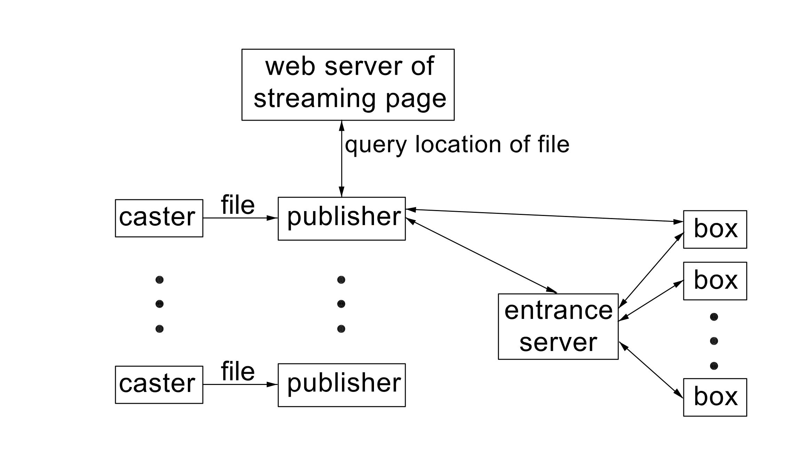

# Dandelion


## Abstract
Dandelion platform aims to optimize bandwidth usage by re-allocating idle bandwidth for other purposes, 
such as live streaming.  The platform consists of an "entrance server", "boxes", and "publishers". 

Boxes are microprocessors distributed among household that collect any unused bandwidth. The location and 
system information of each box is recorded onto the entrance server's database. All recorded boxes periodically
send pertinent information, such as measured bandwidth, available memory space and GEOIP info, etc., to the 
entrance server. If the entrance server does not receive any updates from a box after some given time, the 
server will remove that box from its database. Each publisher keeps track of a list of box information from 
the entrance server. Users access the collected bandwidth through publishers. Users first push the file to 
the publisher. Then the publisher picks an appropriate box from its list and send the file to that box. If 
users would like to know where the file goes, they could make queries to the publisher. 

Currently, we use web sockets to exchange information and zeromq to send files from publishers to boxes.
However, everything is still in an incipient stage, nothing is guaranteed to use in future. For example, 
we might want to use udp or quic instead of http in exchanging information progress in order to save unnecessary 
connections. Feel free to folk to make this project better.

Update 2017/4/18
Zeromq has been removed. Use websocket instead.

## Graph


## Before Start
##### Make sure that python's version is higher than 3.5 and run command below
```
sudo pip3 install -r requirements.txt
python3 setup.py install
```
##### Other required Installation (without using docker)
- Redis
- Nginx (as a proxy server)

## Get started
- Duplicate the config.yaml.example file and rename it to config.yaml. Please configure the settings in the file properly according to your character (Entrance server, box and publisher).

- Run
```
python3 run_box.py
python3 run_entrance.py
python3 run_publisher.py
```

- You can inspect the program in dandelion.log
```
tail -f dandelion.log
```

- You can also fire up by docker, which is much easier.
```
sudo docker-compose -f <compose-filename> build
sudo docker-compose -f <compose-filename> up 
```

## Testing
##### Run all test cases
```
python3 -m unittest
```
##### Coverage
```
coverage run -m unittest
coverage report
```

## Developer Document
### Point to Point Exchange Info format

##### Box to Entrance (EXCHANGE REQUEST)
- ID
- IP
- PORT
- COMMAND: EXCHANGE
- TYPE: BOX
- CONNECT_WS  (url where web socket should connect to)
- SYSTEM INFO (for box)
    - CPU
    - Network Bandwidth
    - Storage Size

- GEOIP
    - IP
    - HOSTNAME
    - COUNTRY
    - CITY
    - REGION
    - ORG
    - LOC
    
##### Entrance to Box (EXCHANGE RESPONSE)
- ID
- IP
- PORT
- COMMAND: EXCHANGE
- TYPE: Entrance

##### Publisher to Entrance (SEARCH REQUEST)
- ID
- IP
- PORT
- COMMAND: SEARCH
- TYPE: PUBLISHER
- GEOIP
    - IP
    - HOSTNAME
    - COUNTRY
    - CITY
    - REGION
    - ORG
    - LOC

##### Entrance to Publisher (SEARCH RESPONSE)
- ID
- IP
- PORT
- URL
- COMMAND: SEARCH
- TYPE: ENTRANCE
- BOX_SET (a dict, box_id as key, box's exchange as value)
    - BOX_ID 
        - {BOX_EXCHANGE}
- ENTRANCE_URL
    - {Entrance URL}

##### Publisher to Box 
###### SEARCHING (PUBLISH REQUEST)
- ID
- IP
- PORT
- COMMAND: PUBLISH
- TYPE: PUBLISHER

###### SEARCHING (PUBLISH RESPONSE)
- ID
- IP
- PORT
- COMMAND: PUBLISH
- TYPE: BOX
- MESSAGE: "ACCEPTED" or ERROR: error message


###### TRANSFER FILES (BINARY REQUEST)
- Format: b'<Dandelion>'+ (BINARY HEADERS IN JSON) + b'</Dandelion>' + file's content
- HEADERS
    - FILE_PATH
    - TTL

###### TRANSFER FILES (BINARY RESPONSE)
None


## Box
##### ID
- box-(HASH)
### Redis KEY Namespace
- {ID}:SELF_EXCHANGE
- {ID}:EXCHANGE
- {ID}:SUBSCRIBE:{PUBLISHER ID}
- {ID}:EXPIRE_FILES  (sorted set)

## Publisher
##### ID
- publisher-(HASH)
##### Redis KEY Namespace
- {ID}:SEARCH:{BOX_ID} (hash)
- {ID}:SELF_INFO (hash)
- {ID}:BOX_RANKING  (sorted set)
- {ID}:FILE:FILES_SENDING_QUEUE (list, for api to push file path into it)
- {ID}:FILE:BOX_LIST
- {ID}:FILE:PROCESSED_FILES


## Entrance Server 
##### ID
- entrance-(HASH)
##### URL (Base_url/)
- index
- ws_change/ : handling incoming websocket

##### Redis KEY Namespace
- {ID}:BOX_SET: Set that contains all the available box
- {ID}:EXCHANGE:<box_id>: Hash that contains exchange messages from boxes
- {ID}:OWN_INFO (hash)

## License
Released under [the MIT License](https://github.com/ktshen/Dandelion/blob/master/License)
